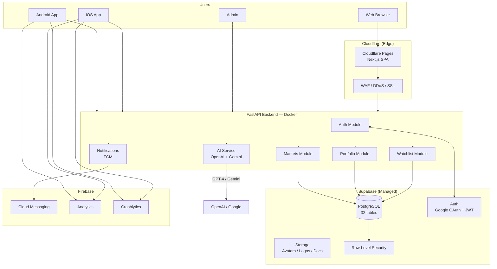
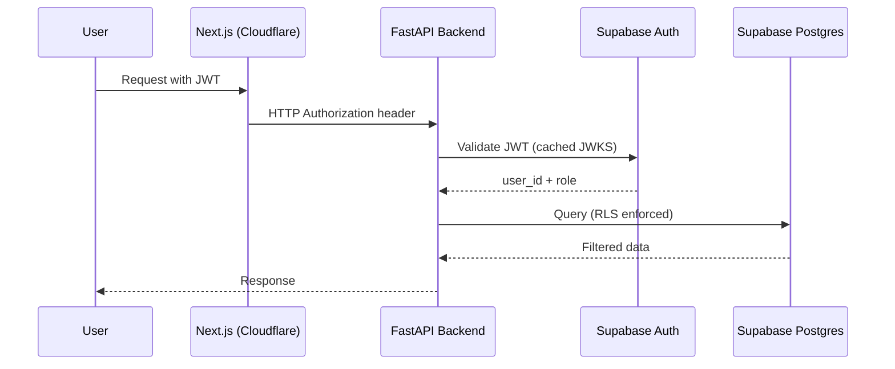
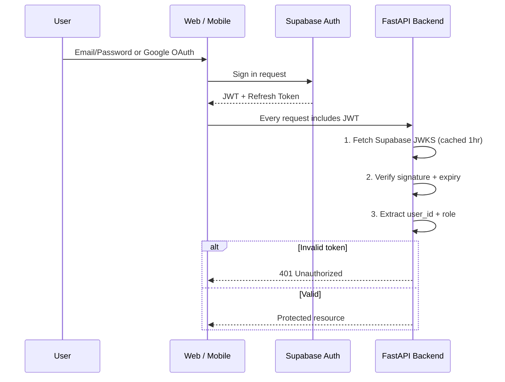
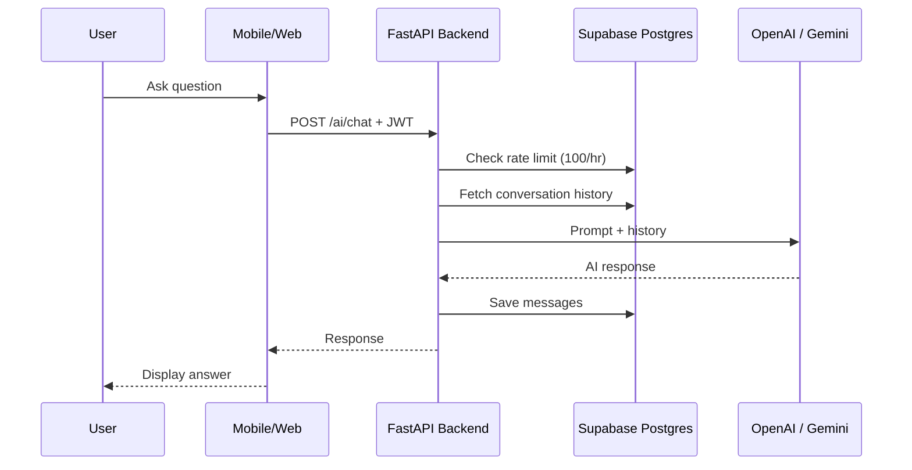
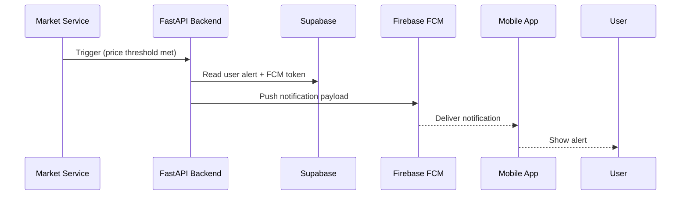

# FinSwitch — Production Infrastructure Architecture

---

## 1. System Architecture



## 2. Technology Stack Justification

| Layer | Choice | Why |
|-------|--------|-----|
| **Website** | Next.js + Cloudflare Pages | Global edge deployment, zero cold starts, free tier generous, automatic HTTPS. SSR for SEO-critical pages (marketing, blog). |
| **Mobile** | Flutter + Material 3 | Single codebase for Android/iOS. Riverpod for state (compile-safe, testable). GoRouter for declarative routing. |
| **Backend** | FastAPI + Python | Async by default, auto OpenAPI docs, Pydantic validation. Best Python option for JSON-heavy financial APIs. |
| **Database** | Supabase PostgreSQL | Managed Postgres with built-in Auth, Storage, and Row-Level Security. Reduces operational overhead by 60% compared to self-hosted. |
| **Auth** | Supabase Auth | Drop-in Google OAuth, magic link, password reset. JWT validation middleware in FastAPI validates Supabase JWTs. No custom auth server. |
| **AI** | OpenAI (analysis) + Gemini (fallback) | OpenAI for structured financial analysis. Gemini as cheaper fallback for simpler queries. Both called server-side only. |
| **Hosting (MVP)** | Railway | Fast setup, per-container pricing, automatic HTTPS, DB hosting included. Single `railway.toml` deploys everything. |
| **Hosting (Prod)** | DigitalOcean App Platform | Dedicated CPU, predictable pricing ($12-168/mo), managed Postgres option, 99.99% SLA. Easy to migrate from Railway. |
| **CI/CD** | GitHub Actions | Tight GitHub integration, free for public repos, matrix builds for Flutter (Android + iOS). |
| **Monitoring** | Sentry + Grafana + UptimeRobot | Sentry for errors, Grafana Cloud for metrics, UptimeRobot for free uptime alerts. |

## 3. Cloud Architecture — Request Flows

### 3a. Authenticated API Request



### 3b. Authentication Flow



### 3c. AI Chat Flow



### 3d. Notification Flow


    ↓
FastAPI appends conversation history from PostgreSQL
    ↓
Calls OpenAI GPT-4 (or Gemini fallback)
    ↓
Saves user message + AI response to `ai_messages` table
    ↓
Applies rate limit (100 req/hr per user)
    ↓
Returns response
```

## 4. Database Design

### 4.1 Supabase PostgreSQL Schema (Existing + Migrate)

The current `database/schema.sql` defines the complete schema (32 tables). Migration plan:

```sql
-- Key tables to keep/optimize for Supabase:

-- USERS (Supabase manages auth.users automatically)
-- Link custom profile via user_id FK to auth.users
CREATE TABLE public.profiles (
  id UUID PRIMARY KEY REFERENCES auth.users(id) ON DELETE CASCADE,
  display_name TEXT,
  avatar_url TEXT,
  phone TEXT,
  preferences JSONB DEFAULT '{"theme":"dark","language":"en","currency":"INR"}',
  onboarding_completed BOOLEAN DEFAULT false,
  interests TEXT[] DEFAULT '{}',
  created_at TIMESTAMPTZ DEFAULT NOW(),
  updated_at TIMESTAMPTZ DEFAULT NOW()
);

-- Enable RLS
ALTER TABLE public.profiles ENABLE ROW LEVEL SECURITY;

-- RLS: users can only read/update their own profile
CREATE POLICY "users_own_profile" ON public.profiles
  FOR ALL USING (auth.uid() = id);
```

**Tables to migrate from schema.sql** (all with RLS): companies, stock_prices, market_snapshot, indices, portfolios, portfolio_holdings, transactions, watchlists, watchlist_items, alerts, sip_plans, news_articles, news_stocks, ai_chats, ai_messages, notifications, financial_ratios, courses, course_modules, quizzes, certificates.

**Tables to drop** (never used): calculator_history, user_sessions (Supabase handles this), audit_logs (use Supabase audit), api_keys, financial_statements, shareholding_patterns.

### 4.2 Row-Level Security Pattern

```sql
-- Every table gets RLS. Example for portfolios:
CREATE POLICY "user_portfolios" ON public.portfolios
  FOR ALL USING (user_id = auth.uid());

CREATE POLICY "user_holdings" ON public.portfolio_holdings
  FOR ALL USING (
    portfolio_id IN (
      SELECT id FROM public.portfolios WHERE user_id = auth.uid()
    )
  );
```

## 5. API Architecture

### 5.1 Endpoint Structure

All live and verified (13 endpoints tested):

| Endpoint | Method | Auth | Purpose |
|----------|--------|------|---------|
| `/health` | GET | No | Health check |
| `/api/v1/auth/register` | POST | No | Create account |
| `/api/v1/auth/login` | POST | No | Login |
| `/api/v1/auth/me` | GET | Yes | Current user |
| `/api/v1/markets/indices` | GET | No | Nifty, Sensex, Bank Nifty |
| `/api/v1/markets/stocks` | GET | No | All stocks (paginated) |
| `/api/v1/markets/stocks/{symbol}` | GET | No | Stock detail + day stats |
| `/api/v1/markets/gainers` | GET | No | Top gainers |
| `/api/v1/markets/losers` | GET | No | Top losers |
| `/api/v1/portfolio/summary` | GET | Yes | Portfolio snapshot |
| `/api/v1/portfolio/holdings` | GET | Yes | Holdings list |
| `/api/v1/news` | GET | No | News feed |
| `/api/v1/news/{id}` | GET | No | News detail |
| `/api/v1/news/{id}/ai-summary` | GET | No | AI news summary |
| `/api/v1/ai/chat` | POST | Yes | AI chat |
| `/api/v1/ai/chats` | GET | Yes | Chat history list |
| `/api/v1/ai/chats/{id}` | GET | Yes | Single chat detail |
| `/api/v1/watchlist` | GET | Yes | User watchlists |
| `/api/v1/watchlist` | POST | Yes | Create watchlist |
| `/api/v1/watchlist/{id}/items` | POST | Yes | Add stock |
| `/api/v1/watchlist/{id}/items/{sym}` | DELETE | Yes | Remove stock |
| `/api/v1/alerts` | GET/POST | Yes | Price alerts |
| `/api/v1/sip` | GET/POST | Yes | SIP plans |
| `/api/v1/sip/calculate` | POST | No | SIP calculator |
| `/api/v1/learning/courses` | GET | No | Course catalog |
| `/api/v1/users/me` | GET/PUT | Yes | User profile |
| `/api/v1/users/me/preferences` | PUT | Yes | User prefs |

## 6. Folder Structures

```
finswitch/
├── website/                    # Next.js (new)
│   ├── app/
│   │   ├── page.tsx            # Landing
│   │   ├── markets/page.tsx
│   │   ├── portfolio/page.tsx
│   │   ├── news/page.tsx
│   │   ├── ai/page.tsx
│   │   ├── login/page.tsx
│   │   └── dashboard/page.tsx
│   ├── components/
│   │   ├── ui/                 # Button, Card, Input
│   │   └── features/           # StockTable, PortfolioCard
│   ├── lib/
│   │   ├── api.ts              # Fetch wrapper with JWT
│   │   └── supabase.ts         # Supabase client
│   ├── public/
│   ├── next.config.js
│   ├── tailwind.config.ts
│   └── package.json
│
├── flutter_app/                 # Existing Flutter app
│   ├── lib/
│   │   ├── core/               # api.dart, auth_state.dart
│   │   ├── app/                # app.dart, config/
│   │   └── features/           # auth/, home/, markets/, ...
│   ├── android/
│   ├── ios/
│   └── pubspec.yaml
│
├── backend/                     # FastAPI (existing, needs cleanup)
│   ├── app/
│   │   ├── api/v1/             # Route modules
│   │   ├── core/               # config, security, database
│   │   ├── models/             # SQLAlchemy → Supabase RLS style
│   │   ├── schemas/            # Pydantic (keep market/portfolio)
│   │   ├── services/           # ai_service, market_service
│   │   └── main.py
│   ├── requirements.txt
│   ├── Dockerfile
│   └── .env.example
│
├── admin/                       # Admin dashboard (future)
│   └── index.html               # Minimal placeholder
│
├── .github/
│   └── workflows/
│       ├── deploy-backend.yml
│       ├── deploy-website.yml
│       └── build-flutter.yml
│
├── INFRASTRUCTURE.md
└── run.sh
```

## 7. CI/CD Pipeline

### 7.1 GitHub Actions

```yaml
# .github/workflows/deploy-backend.yml
name: Deploy Backend
on:
  push:
    branches: [main]
    paths: ['backend/**']
jobs:
  test:
    runs-on: ubuntu-latest
    steps:
      - uses: actions/checkout@v4
      - uses: actions/setup-python@v5
        with: { python-version: '3.12' }
      - run: pip install -r backend/requirements.txt
      - run: pytest backend/  # when tests exist
  deploy:
    needs: test
    runs-on: ubuntu-latest
    steps:
      - uses: actions/checkout@v4
      - uses: superfly/flyctl-actions/setup-flyctl@master
      - run: flyctl deploy --remote-only
        working-directory: backend
        env:
          FLY_API_TOKEN: ${{ secrets.FLY_API_TOKEN }}
```

### 7.2 Branch Strategy

```
main          → Production (protected, auto-deploy)
├── develop   → Staging (auto-deploy to Railway)
├── feat/*    → Feature branches
├── fix/*     → Bug fixes
└── release/* → Release candidates
```

## 8. Security Architecture

### 8.1 Layered Security Model

```
┌──────────────────────────────────────┐
│ Layer 1: Cloudflare                   │
│  DDoS protection, WAF, HTTPS, Origin │
│  CA, Rate limiting per IP             │
├──────────────────────────────────────┤
│ Layer 2: FastAPI Backend              │
│  JWT validation (Supabase JWKS)      │
│  CORS (restrict to Cloudflare domain) │
│  Request size limits (10MB max)      │
│  Rate limiting (100/hr per user)     │
│  Input validation (Pydantic)         │
├──────────────────────────────────────┤
│ Layer 3: Supabase                     │
│  Row-Level Security on every table   │
│  Auth manages sessions/tokens        │
│  Storage bucket policies             │
│  SSL enforced                        │
└──────────────────────────────────────┘
```

### 8.2 JWT Validation Middleware (FastAPI)

```python
from supabase import create_client
from fastapi import HTTPException, Security
from fastapi.security import HTTPBearer

supabase = create_client(SUPABASE_URL, SUPABASE_SERVICE_KEY)

async def verify_jwt(token: str = Security(HTTPBearer())):
    try:
        user = supabase.auth.get_user(token.credentials)
        return user.user.id
    except:
        raise HTTPException(status_code=401, detail="Invalid token")
```

### 8.3 Environment Variables

```bash
# Backend (.env)
SUPABASE_URL=https://xxxxx.supabase.co
SUPABASE_SERVICE_KEY=eyJ...  # service_role key for admin ops
SUPABASE_JWT_SECRET=          # for JWT validation
OPENAI_API_KEY=sk-...
GEMINI_API_KEY=...
FIREBASE_SERVER_KEY=...
SENTRY_DSN=https://...
CORS_ORIGINS=https://finswitch.com,https://www.finswitch.com
RATE_LIMIT_PER_HOUR=100
LOG_LEVEL=INFO

# Website (Next.js)
NEXT_PUBLIC_API_URL=https://api.finswitch.com
NEXT_PUBLIC_SUPABASE_URL=https://xxxxx.supabase.co
NEXT_PUBLIC_SUPABASE_ANON_KEY=eyJ...  # anon key (safe for client)
NEXT_PUBLIC_GA_ID=G-...
NEXT_PUBLIC_CLARITY_ID=...

# Flutter (build-time)
SUPABASE_URL=
SUPABASE_ANON_KEY=
API_BASE_URL=
FIREBASE_OPTIONS_FILE=
```

## 9. Deployment Guide

### 9.1 Supabase Setup

```bash
# 1. Create Supabase project (supabase.com)
# 2. Run schema migration
psql "$SUPABASE_DB_URL" -f database/schema.sql

# 3. Enable auth providers
#    Settings → Authentication → Providers
#    Enable Email + Google

# 4. Create storage buckets
#    avatars (public read, authenticated write)
#    company-logos (public read)
#    news-images (public read)
```

### 9.2 Backend Deployment (Railway — MVP)

```bash
# 1. Install Railway CLI
npm i -g @railway/cli

# 2. Login and init
railway login
railway init

# 3. Deploy
railway up

# 4. Set environment variables
railway variables set SUPABASE_URL=... SUPABASE_SERVICE_KEY=...

# 5. Add volume for persistent data
#    Or connect Railway Postgres plugin
```

### 9.3 Website Deployment (Cloudflare Pages)

```bash
# 1. Build Next.js
cd website && npm run build

# 2. Deploy via Cloudflare Dashboard:
#    Pages → Create → Connect to GitHub repo
#    Build command: npm run build
#    Output dir: out

# 3. Set env vars in Cloudflare dashboard
# 4. Add custom domain → finswitch.com
```

### 9.4 Flutter Build

```bash
# Android
cd flutter_app
flutter build apk --release --split-per-abi
# Output: build/app/outputs/flutter-apk/app-arm64-v8a-release.apk

# iOS
flutter build ios --release
# Archive via Xcode → App Store Connect
```

## 10. Monitoring Strategy

| Tool | What | Cost |
|------|------|------|
| **Sentry** | Error tracking (backend + Flutter) | Free tier: 5k events/mo |
| **Grafana Cloud** | CPU, memory, DB queries | Free tier: 3 dashboards |
| **UptimeRobot** | HTTP health check every 5min | Free: 50 monitors |
| **Supabase Dashboard** | DB performance, slow queries | Built-in |
| **Firebase Crashlytics** | Mobile crash reporting | Free |
| **Google Analytics** | Website traffic | Free |

**Alert thresholds:**
- API latency > 2s → Slack notification
- Error rate > 1% → PagerDuty (future)
- DB connections > 80% → Scale up
- Uptime < 99.9% → Investigate

## 11. Backup & Recovery

### Database (Supabase — automatic)

- **Point-in-time recovery**: Supabase Pro ($25/mo) includes PITR with 7-day retention
- **Manual backups**: Daily `pg_dump` via cron → Supabase Storage bucket (private)
- **Schema exports**: Keep in repo under `database/schema.sql`

### Recovery Plan

```
Tier 1 (critical): User data, portfolio, holdings
  → PITR recovery, RTO < 1hr, RPO < 5min

Tier 2 (important): Company data, stock prices, news  
  → Re-fetch from external APIs, RTO < 4hrs

Tier 3 (nice): AI chat history, learning progress
  → Restore from daily dump, RTO < 24hrs
```

## 12. Scaling Strategy

| Stage | Users | Bottleneck | Solution | Est. Cost |
|-------|-------|------------|----------|-----------|
| **MVP** | 100 | Backend cold start | Railway auto-sleep | ~$15/mo |
| **Launch** | 1,000 | API latency | Dedicated Railway container (1CPU/2GB) | ~$50/mo |
| **Growth** | 10,000 | DB queries | Supabase Pro ($25) + PgBouncer + API caching (Redis) | ~$150/mo |
| **Scale** | 100,000 | Backend CPU | Horizontal scaling: 3× API containers behind Railway TCP proxy | ~$500/mo |
| **Enterprise** | 1M+ | Everything | DigitalOcean dedicated droplets, read replicas, CDN, Redis cluster, Kubernetes | ~$3k/mo |

**Caching strategy in order:**
1. **Cloudflare Cache** — Static assets, stock quotes (TTL 60s)
2. **FastAPI in-memory** — Market snapshot (TTL 15s) per worker
3. **Redis** — Session data, AI rate limit counters (Railway Redis or Upstash)
4. **Database** — Connection pooling with PgBouncer, read replicas for news/courses

## 13. Production Checklist

- [ ] Supabase project created with RLS on all tables
- [ ] Google OAuth + Email auth enabled in Supabase
- [ ] Environment variables set in Railway, Cloudflare, GitHub Secrets
- [ ] JWT validation middleware implemented in FastAPI
- [ ] CORS restricted to production domains
- [ ] Rate limiting enabled (100 req/hr per user, 1000/hr per IP)
- [ ] Cloudflare WAF rules: block SQLi, XSS, known bad IPs
- [ ] Sentry DSN configured for backend + Flutter
- [ ] Firebase Crashlytics configured for Flutter
- [ ] UptimeRobot monitoring `/health` endpoint
- [ ] Daily DB backup script running
- [ ] CI/CD pipelines green on `main`
- [ ] `robots.txt` and `sitemap.xml` for SEO
- [ ] Security headers: `Strict-Transport-Security`, `X-Content-Type-Options`, `X-Frame-Options`
- [ ] Flutter app built and tested on both Android + iOS
- [ ] App signing: Play Store + TestFlight
- [ ] Privacy policy and terms of service pages

## 14. Cost Estimate

### MVP (100 users)

| Service | Cost/mo |
|---------|---------|
| Railway (1 container, no DB) | $5 |
| Supabase Free (500MB DB, 5GB bandwidth) | $0 |
| Cloudflare Pages (free tier) | $0 |
| OpenAI API (100 chats/mo) | ~$2 |
| Firebase (free tier) | $0 |
| Sentry Free | $0 |
| UptimeRobot Free | $0 |
| Domain (finswitch.com) | $1/mo amortized |
| **Total** | **~$8/mo** |

### Production (10,000 users)

| Service | Cost/mo |
|---------|---------|
| Railway Pro (2 containers, 4GB RAM) | $50 |
| Supabase Pro (8GB DB, 50GB bandwidth, PITR) | $25 |
| Cloudflare Pages (free) | $0 |
| Redis (Upstash, 100MB) | $5 |
| OpenAI API (10k chats/mo) | ~$30 |
| Firebase (free tier) | $0 |
| Sentry Team | $29 |
| UptimeRobot Pro | $7 |
| **Total** | **~$146/mo** |

## 15. Future Improvements

1. **WebSocket for live prices** — Replace polling with real-time stock updates via Supabase Realtime or WebSocket
2. **Kubernetes migration** — When Railway costs exceed $200/mo, migrate to DigitalOcean K8s ($40/mo + nodes)
3. **Multi-region** — Supabase doesn't support read replicas yet. When needed: AWS Aurora for DB, Cloudflare for edge
4. **Feature flags** — LaunchDarkly or custom Supabase-based flags for gradual rollouts
5. **Terraform/Pulumi** — Infrastructure-as-code for reproducible environments
6. **End-to-end encryption** — For portfolio data at rest
7. **SOC2 compliance** — Required for enterprise fintech customers
8. **White-labeling** — Tenant-isolated architecture for B2B clients
