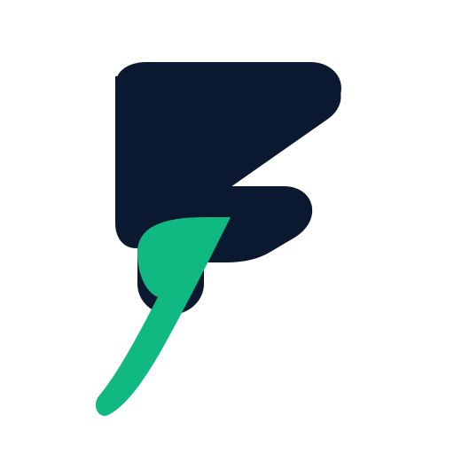
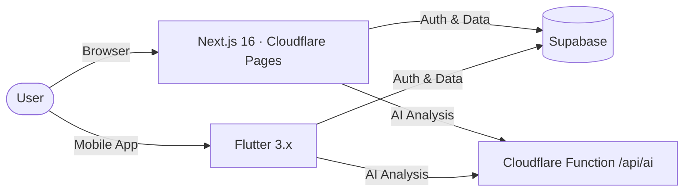
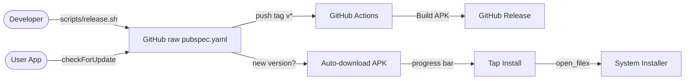

<div align="center">
  
  <h1 style="font-size: 2.5em; margin: 8px 0; color: #0A192F;">FinSwitch</h1>
  <p style="font-size: 1em; letter-spacing: 3px; font-weight: 700; color: #10B981; margin: 0;">SWITCH. SAVE. SMARTER.</p>
  <p style="font-size: 1.1em; color: #64748B;"><strong>AI-Powered Financial Intelligence for Indian Markets</strong></p>

  <br>

  <a href="https://finswitch.pages.dev">
    
  </a>
  <a href="https://finswitch.pages.dev/downloads/finswitch.apk">
    
  </a>
  <a href="https://github.com/OK45batwal/FINSWITCH/releases">
    
  </a>
  <a href="LICENSE">
    
  </a>

  <br><br>

  
</div>

<br>

## ✨ Features

<table>
  <tr>
    <td width="33%" align="center"><strong>🤖 AI Financial Copilot</strong><br><small>Natural language stock analysis, buy/sell scores, and market insights</small></td>
    <td width="33%" align="center"><strong>📊 Live Markets</strong><br><small>Nifty 50, Sensex, Bank Nifty — real-time indices & stock data</small></td>
    <td width="33%" align="center"><strong>💼 Portfolio Tracker</strong><br><small>Holdings, P&L, sector allocation, and returns tracking</small></td>
  </tr>
  <tr>
    <td align="center"><strong>⭐ Watchlist</strong><br><small>Follow your favorite stocks with instant updates</small></td>
    <td align="center"><strong>📈 60-Day Charts</strong><br><small>OHLCV data with RSI, SMA, support & resistance</small></td>
    <td align="center"><strong>📰 Smart News</strong><br><small>Curated financial news with stock-specific relevance</small></td>
  </tr>
  <tr>
    <td align="center"><strong>🌙 Dark & Light Themes</strong><br><small>Seamless theme switching on web & mobile</small></td>
    <td align="center"><strong>📱 Offline Ready</strong><br><small>Works with zero network — full local fallback</small></td>
    <td align="center"><strong>🔄 Auto Update</strong><br><small>Automatic APK download & install prompt on new version</small></td>
  </tr>
</table>

---

## 🖥️ Web App

<table>
  <tr>
    <td width="50%"></td>
    <td width="50%"></td>
  </tr>
  <tr>
    <td align="center"><em>Marketing landing page</em></td>
    <td align="center"><em>Market dashboard</em></td>
  </tr>
  <tr>
    <td width="50%"></td>
    <td width="50%"></td>
  </tr>
  <tr>
    <td align="center"><em>Mobile responsive view</em></td>
    <td align="center"><em>Portfolio view</em></td>
  </tr>
</table>

## 📱 Mobile App

<table>
  <tr>
    <td width="20%"></td>
    <td width="20%"></td>
    <td width="20%"></td>
    <td width="20%"></td>
    <td width="20%"></td>
  </tr>
  <tr>
    <td align="center"><em>Home Dashboard</em></td>
    <td align="center"><em>Live Markets</em></td>
    <td align="center"><em>AI Copilot</em></td>
    <td align="center"><em>Portfolio</em></td>
    <td align="center"><em>Financial News</em></td>
  </tr>
</table>

---

## 🚀 Quick Start

### Web
```bash
cd website && npm install && npm run dev
```

### Mobile
```bash
cd flutter_app && flutter pub get && flutter run
```

### Run everything (backend + web)
```bash
./run.sh
```

---

## 🏗️ Architecture



---

## 🔄 Auto Update Flow



---

## 🧰 Tech Stack

| Layer | Technology |
|-------|-----------|
| **Frontend (Web)** | Next.js 16, React 19, Turbopack, Tailwind CSS v4 |
| **Mobile** | Flutter 3.x, go_router, supabase_flutter |
| **AI Engine** | Cloudflare Pages Function (JS, zero deps) |
| **Database** | Supabase (PostgreSQL) |
| **Hosting** | Cloudflare Pages (free tier) |
| **CI/CD** | GitHub Actions, Cloudflare Pages auto-deploy |

---

## 📄 License

MIT — see [LICENSE](LICENSE).

<div align="center">
  <br>
  <a href="https://finswitch.pages.dev">🌐 finswitch.pages.dev</a> ·
  <a href="https://finswitch.pages.dev/downloads/finswitch.apk">📱 Download APK</a> ·
  <a href="https://github.com/OK45batwal/FINSWITCH">📦 GitHub</a>
  <br><br>
  <small>Built for smarter investing in India</small>
</div>
