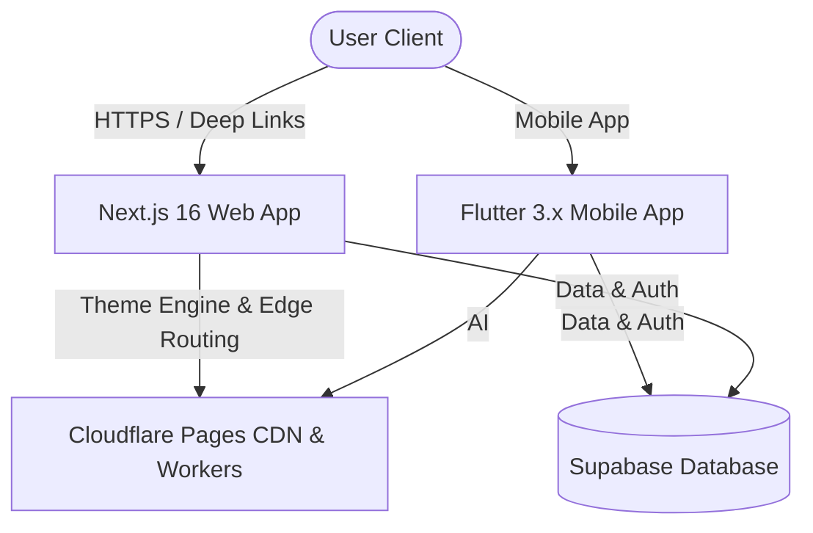

<div align="center">
  
  
  <br>

  <h1 align="center" style="font-size: 2.8em; margin: 10px 0; font-weight: 800; color: #0A192F;">
    FinSwitch
  </h1>
  
  <p align="center" style="font-size: 1.1em; letter-spacing: 3px; font-weight: 700; color: #10B981;">
    S W I T C H . &nbsp; S A V E . &nbsp; S M A R T E R .
  </p>

  <p align="center">
    <strong>The AI-Powered Financial Decision Intelligence Platform for Indian Markets</strong>
  </p>

  <br>

  <p align="center">
    <a href="https://finswitch.pages.dev">
      
    </a>
    <a href="https://finswitch.pages.dev/downloads/finswitch.apk">
      
    </a>
    <a href="https://github.com/OK45batwal/FINSWITCH">
      
    </a>
    <a href="LICENSE">
      
    </a>
  </p>

  <p align="center">
    
    
    
    
  </p>

</div>

<br>

---

## 📌 Navigation & Quick Links

<p align="center">
  <a href="#-overview">Overview</a> •
  <a href="#-brand-identity--concept">Brand Identity</a> •
  <a href="#-key-features">Key Features</a> •
  <a href="#-system-architecture">Architecture</a> •
  <a href="#-screenshots">Screenshots</a> •
  <a href="#-quick-start">Quick Start</a> •
  <a href="#-api-endpoints">API Docs</a> •
  <a href="#-security--hardening">Security</a>
</p>

---

## ✦ Overview

> [!IMPORTANT]
> **FinSwitch is a Financial Decision Intelligence Engine, NOT a Stock Broker.**
> FinSwitch does not execute direct stock trades. Instead, it provides real-time market data, deterministic technical indicator analysis, AI-driven stock evaluation, and portfolio optimization.

**FinSwitch** empowers retail investors in India with institution-grade financial market intelligence. By combining real-time Nifty & Sensex market feeds, LLM-powered financial reasoning (Gemini / OpenAI), 14-period Wilder's RSI, 20-period Simple Moving Averages, and 2-step OTP authentication, FinSwitch bridges the gap between complex market data and confident financial decisions.

---

## ✦ Brand Identity & Concept

```
  ₹ (Rupee) + F (Finance) = ₹ Monogram Symbol
```

* **Symbolism**: The top bar structure forms the letter **F** (Finance) in **Midnight Navy (`#0A192F`)**, fused with the iconic double bars of the **Indian Rupee symbol (`₹`)**.
* **Growth Swoop**: The bottom curved leg swoops downwards and arches dynamically upwards in **Emerald Mint Green (`#10B981`)**, symbolizing market growth and switching to better options.

<div align="center">

| Value | Focus | Description |
| :---: | :---: | :--- |
| 🔄 | **SWITCH** | Access better financial options and smarter market alternatives |
| 🐷 | **SAVE** | Preserve capital and optimize return-to-risk ratio |
| 📈 | **GROW** | Achieve compound long-term wealth expansion |
| 🛡️ | **SMARTER** | Make confident, data-backed investment choices |

</div>

---

## ✦ Key Features & Dual Theme Engine

| Feature | Description | Light & Dark Mode | Platform |
| :--- | :--- | :---: | :--- |
| **🤖 AI Financial Copilot** | Natural language analysis powered by LLMs (Gemini / OpenAI) with context-grounded stock insights. | ✅ Supported | Web & Mobile |
| **🎨 Light & Dark Themes** | Seamless theme switching (☀️ Light / 🌙 Dark) on Web and Flutter Mobile App. | ✅ Supported | Web & Mobile |
| **🔐 6-Digit OTP Auth** | 2-step passwordless OTP verification for fast, secure user registration and sign-in. | ✅ Supported | Web & Mobile |
| **📊 Real-Time Market Data** | Live tracking of Nifty 50, Sensex, Bank Nifty, and 10,000+ Indian stocks with interactive charts. | ✅ Supported | Web & Mobile |
| **💼 Portfolio Tracker** | Track holdings, analyze sector allocation, and view real-time P&L with dynamic positive/negative formatting. | ✅ Supported | Web & Mobile |
| **📈 Technical Indicators** | Mathematical, deterministic 14-period Wilder's RSI and 20-period Simple Moving Averages (SMA). | ✅ Supported | Web & Mobile |
| **📰 Smart News Feed** | Curated financial market news with sentiment classification and related stock impact. | ✅ Supported | Web & Mobile |
| **📲 Android Deep Linking** | Direct `https://finswitch.pages.dev/stock/:symbol` intent filters for seamless sharing. | ✅ Supported | Mobile |

---

## ✦ System Architecture



---

## ✦ Screenshots

### 🌐 Next.js Web Platform (Bento Grid)

<table>
  <tr>
    <td width="50%"></td>
    <td width="50%"></td>
  </tr>
  <tr>
    <td align="center"><em>Bento Grid Hero Section (Light & Dark Theme)</em></td>
    <td align="center"><em>Desktop Market Dashboard</em></td>
  </tr>
</table>

### 📱 Flutter Cross-Platform Mobile App

<table>
  <tr>
    <td width="20%"></td>
    <td width="20%"></td>
    <td width="20%"></td>
    <td width="20%"></td>
    <td width="20%"></td>
  </tr>
  <tr>
    <td align="center"><em>Home Dashboard</em></td>
    <td align="center"><em>Live Markets</em></td>
    <td align="center"><em>AI Copilot</em></td>
    <td align="center"><em>Portfolio</em></td>
    <td align="center"><em>Financial News</em></td>
  </tr>
</table>

---

## ✦ Quick Start

### 1. Web Application (Next.js 16)
```bash
# Navigate to website directory
cd website

# Install dependencies
npm install

# Run local dev server
npm run dev
# Open http://localhost:3000
```

### 2. Mobile App (Flutter 3.x)
```bash
# Navigate to flutter_app directory
cd flutter_app

# Fetch packages & run linter
flutter pub get
flutter analyze

# Launch on connected device / emulator
flutter run
```

---

## ✦ Security & Production Hardening

- 🔒 **Zero Hardcoded Secrets**: Credentials, Supabase keys, and tokens are read exclusively from environment variables / GitHub Secrets.
- 🔑 **Guarded Dev OTP Bypass**: Test OTP bypass (`123456`) is restricted to `kDebugMode` in Flutter and `NODE_ENV === 'development'` on the web.
- 🚦 **CI/CD Quality Gates**: Automated `flutter analyze` and `npm run lint` on all pull requests and pushes.

---

## ✦ License

Distributed under the **MIT License**. See [`LICENSE`](LICENSE) for details.

<br>

<div align="center">
  <p>Built with ❤️ for smarter investing in India</p>
  <p>
    <a href="https://finswitch.pages.dev">🌐 Live Website</a> ·
    <a href="https://finswitch.pages.dev/downloads/finswitch.apk">📱 Download APK (54.6 MB)</a> ·
    <a href="https://github.com/OK45batwal/FINSWITCH">GitHub Repository</a>
  </p>
</div>
