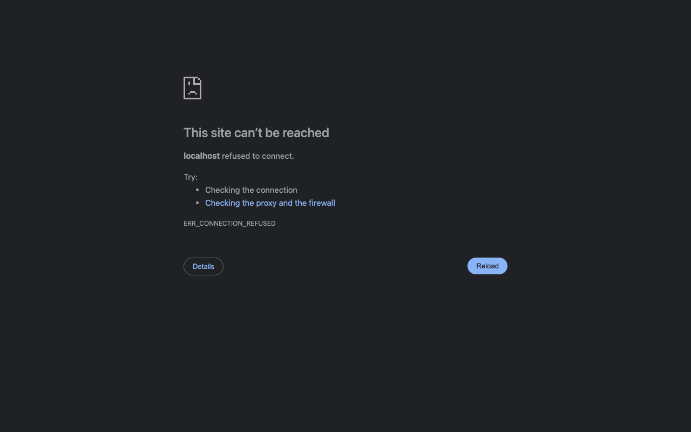
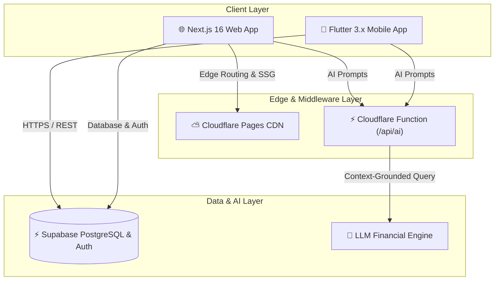
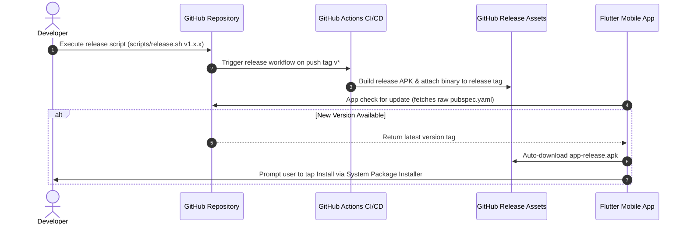

<div align="center">
  <a href="https://finswitch.pages.dev">
    
  </a>

  <h1 align="center" style="font-size: 2.5rem; font-weight: 800; border-bottom: none; margin-top: 10px;">
    FinSwitch
  </h1>

  <p align="center" style="font-size: 0.95rem; font-weight: 700; letter-spacing: 2px; color: #10B981; margin-top: -10px;">
    S W I T C H &nbsp;·&nbsp; S A V E &nbsp;·&nbsp; S M A R T E R
  </p>

  <p align="center" style="font-size: 1.1rem; color: #64748B;">
    <strong>AI-Powered Financial Decision Intelligence for Indian Stock Markets</strong>
  </p>

  <br>

  <p align="center">
    <a href="https://finswitch.pages.dev">
      
    </a>
    <a href="https://finswitch.pages.dev/downloads/finswitch.apk">
      
    </a>
    <a href="https://github.com/OK45batwal/FINSWITCH/releases">
      
    </a>
    <a href="LICENSE">
      
    </a>
  </p>

  <p align="center">
    
    
    
    
    
  </p>
</div>

<br>

---

## 📌 Quick Navigation

<p align="center">
  <a href="#-overview">Overview</a> •
  <a href="#-brand-philosophy">Brand Philosophy</a> •
  <a href="#-key-features">Key Features</a> •
  <a href="#-web-platform">Web Platform</a> •
  <a href="#-mobile-application">Mobile App</a> •
  <a href="#-architecture">Architecture</a> •
  <a href="#-auto-update-pipeline">Auto-Update</a> •
  <a href="#-quick-start">Quick Start</a> •
  <a href="#-tech-stack">Tech Stack</a>
</p>

---

## ✦ Overview

> [!IMPORTANT]
> **FinSwitch is a Decision Intelligence Engine, NOT a Stock Broker.**
> FinSwitch does not execute direct stock trades. Instead, it provides real-time market feeds, deterministic technical indicator analysis (RSI-14, SMA-20), LLM-powered stock evaluation, and portfolio tracking to help retail investors in India make confident financial choices.

**FinSwitch** bridges the gap between raw financial data and actionable decision-making. Available as a Next.js 16 Web Platform and cross-platform Flutter Mobile Application, it offers seamless dark/light theme options, offline fallback capabilities, and instant OTA app update delivery.

---

## ✦ Brand Philosophy

```
  ₹ (Rupee)  +  F (Finance)  =  ₹ Monogram Symbol
```

<div align="center">

| Pillar | Focus | Value Proposition |
| :---: | :---: | :--- |
| 🔄 | **SWITCH** | Transition from noise to superior, data-backed financial options |
| 🐷 | **SAVE** | Preserve capital and optimize risk-adjusted returns |
| 📈 | **GROW** | Foster long-term compound wealth expansion |
| 🛡️ | **SMARTER** | Leverage AI insights and technical analytics for informed trading |

</div>

---

## ✦ Key Features

| Feature | Description | Support |
| :--- | :--- | :---: |
| **🤖 AI Financial Copilot** | Natural language analysis powered by LLMs with context-grounded stock evaluation and buy/sell scoring. | Web & Mobile |
| **🎨 Light & Dark Themes** | Seamless, dynamic theme switching (☀️ Light / 🌙 Dark) across Web and Flutter Mobile App. | Web & Mobile |
| **📊 Real-Time Market Data** | Live tracking of Nifty 50, Sensex, Bank Nifty, and 10,000+ Indian stock instruments with interactive charts. | Web & Mobile |
| **💼 Portfolio Tracker** | Track holdings, analyze sector allocation, and view real-time P&L with dynamic positive/negative formatting. | Web & Mobile |
| **📈 Technical Indicators** | Mathematical, deterministic 14-period Wilder's RSI, 20-period Simple Moving Averages, and OHLCV charts. | Web & Mobile |
| **📰 Smart News Feed** | Curated financial market news with sentiment tags and stock-specific relevance. | Web & Mobile |
| **🔑 Password Sign In & Auth** | Clean traditional sign in & registration flow with password visibility toggle (👁️ Show/Hide). | Web & Mobile |
| **⚡ Offline Fallback Mode** | High-availability fallback data engine ensuring uninterrupted app usability during network outages. | Web & Mobile |
| **📲 In-App Auto Updater** | Automatic version check and seamless APK download & installation prompts for mobile users. | Mobile |

---

## ✦ Web Platform Showcase

| Landing Page & Hero Banner | Market Intelligence Dashboard |
| :---: | :---: |
|  |  |

| Traditional Sign In & Register System | Responsive Mobile Web Interface |
| :---: | :---: |
|  |  |

---

## ✦ Mobile Application Showcase

| Home Overview | Live Markets | AI Copilot | Portfolio | News Feed |
| :---: | :---: | :---: | :---: | :---: |
|  |  |  |  |  |

---

## ✦ Architecture



---

## ✦ Auto-Update Pipeline



---

## ✦ Quick Start

### 1. Web Application (Next.js 16)
```bash
# Navigate to website directory
cd website

# Install dependencies
npm install

# Start development server
npm run dev
# Open http://localhost:3000
```

### 2. Mobile Application (Flutter 3.x)
```bash
# Navigate to flutter_app directory
cd flutter_app

# Fetch dependencies & verify static analysis
flutter pub get
flutter analyze

# Launch on connected device or emulator
flutter run
```

### 3. Automated Orchestration
```bash
# Launch full stack dev environment via root runner script
./run.sh
```

---

## ✦ Tech Stack

| Layer | Technology & Framework |
| :--- | :--- |
| **Frontend (Web)** | Next.js 16 (App Router), React 19, Turbopack, Tailwind CSS v4 |
| **Mobile App** | Flutter 3.x, Dart 3.x, `go_router`, `supabase_flutter`, `fl_chart` |
| **AI Processing** | Cloudflare Pages Edge Function (JavaScript, zero external dependencies) |
| **Database & Auth** | Supabase (PostgreSQL 15, Row-Level Security, JWT Auth) |
| **Hosting & Edge** | Cloudflare Pages Edge CDN & Cloudflare Functions |
| **CI/CD & DevOps** | GitHub Actions, Cloudflare Pages Deployment, GitHub Releases API |

---

## ✦ License

Distributed under the **MIT License**. See [`LICENSE`](LICENSE) for details.

<br>

<div align="center">
  <p>Built with ❤️ for smarter investing in India</p>
  <p>
    <a href="https://finswitch.pages.dev">🌐 Live Website</a> &nbsp;·&nbsp;
    <a href="https://finswitch.pages.dev/downloads/finswitch.apk">📱 Download APK</a> &nbsp;·&nbsp;
    <a href="https://github.com/OK45batwal/FINSWITCH">📦 GitHub Repository</a>
  </p>
</div>