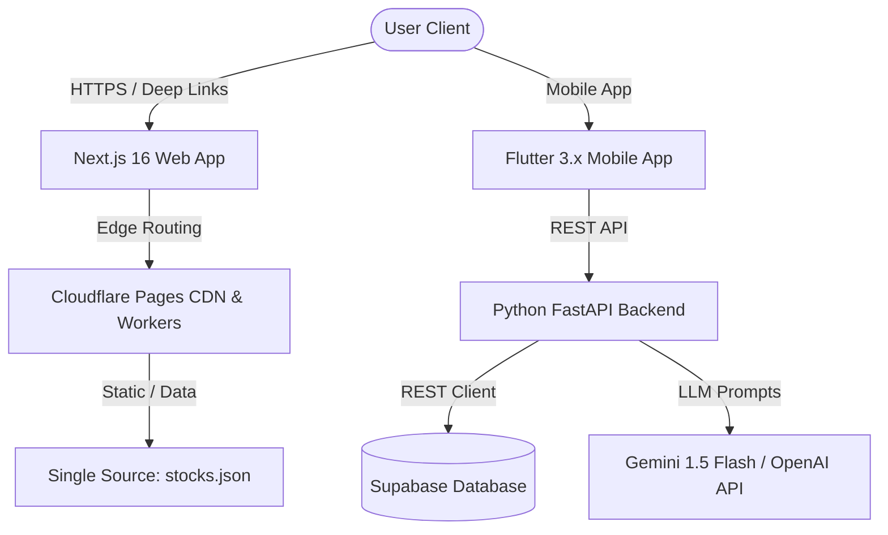

<div align="center">
  
  
  <br><br>

  <p align="center">
    <strong>The AI-Powered Financial Decision Intelligence Platform for Indian Markets</strong>
  </p>

  <p align="center">
    <em>Switch from market noise to confident, data-driven investment decisions.</em>
  </p>

  <br>

  <p align="center">
    <a href="https://finswitch.pages.dev">
      
    </a>
    <a href="https://finswitch.pages.dev/downloads/finswitch.apk">
      
    </a>
    <a href="https://github.com/OK45batwal/FINSWITCH">
      
    </a>
    <a href="LICENSE">
      
    </a>
  </p>

  <p align="center">
    
    
    
    
    
  </p>

</div>

<br>

---

## 📌 Navigation & Quick Links

<p align="center">
  <a href="#-overview">Overview</a> •
  <a href="#-key-features">Key Features</a> •
  <a href="#-system-architecture">Architecture</a> •
  <a href="#-screenshots">Screenshots</a> •
  <a href="#-quick-start">Quick Start</a> •
  <a href="#-api-endpoints">API Docs</a> •
  <a href="#-security--hardening">Security</a>
</p>

---

## ✦ Overview

> [!IMPORTANT]
> **FinSwitch is a Decision Intelligence Platform, NOT a Stock Broker.**
> FinSwitch does not execute direct stock trades. Instead, it provides real-time market data, technical indicator analysis, AI-driven stock evaluation, and portfolio optimization.

**FinSwitch** empowers retail investors in India with institution-grade market insights. By combining real-time Nifty & Sensex market feeds, LLM-powered financial intelligence (Gemini / OpenAI), deterministic technical indicators (RSI-14, SMA-20), and 2-step OTP authentication, FinSwitch bridges the gap between raw data and smart financial action.

---

## ✦ Key Features

| Feature | Description | Platform |
| :--- | :--- | :--- |
| **🤖 AI Financial Copilot** | Natural language analysis powered by LLMs (Gemini / OpenAI) with context-grounded stock insights. | Web & Mobile |
| **🔐 6-Digit OTP Auth** | 2-step passwordless OTP verification for fast, secure user registration and sign-in. | Web & Mobile |
| **📊 Real-Time Market Data** | Live tracking of Nifty 50, Sensex, Bank Nifty, and 10,000+ Indian stocks with interactive charts. | Web & Mobile |
| **💼 Portfolio Tracker** | Track holdings, analyze sector allocation, and view real-time P&L with dynamic positive/negative formatting. | Web & Mobile |
| **📈 Technical Indicators** | Mathematical, deterministic 14-period Wilder's RSI and 20-period Simple Moving Averages (SMA). | Web & Mobile |
| **📰 Smart News Feed** | Curated financial market news with sentiment classification and related stock impact. | Web & Mobile |
| **📲 Android Deep Linking** | Direct `https://finswitch.pages.dev/stock/:symbol` intent filters for seamless sharing. | Mobile |
| **⚡ 4-Layer Edge Redundancy** | Cloudflare Edge `_redirects` and `_headers` ensuring zero 404s for app downloads. | Infrastructure |

---

## ✦ System Architecture



---

## ✦ Screenshots

### 🌐 Next.js Web Platform (Bento Grid)

<table>
  <tr>
    <td width="50%"></td>
    <td width="50%"></td>
  </tr>
  <tr>
    <td align="center"><em>Bento Grid Hero Section</em></td>
    <td align="center"><em>Desktop Market Dashboard</em></td>
  </tr>
</table>

### 📱 Flutter Cross-Platform Mobile App

<table>
  <tr>
    <td width="20%"></td>
    <td width="20%"></td>
    <td width="20%"></td>
    <td width="20%"></td>
    <td width="20%"></td>
  </tr>
  <tr>
    <td align="center"><em>Home Dashboard</em></td>
    <td align="center"><em>Live Markets</em></td>
    <td align="center"><em>AI Copilot</em></td>
    <td align="center"><em>Portfolio</em></td>
    <td align="center"><em>Financial News</em></td>
  </tr>
</table>

---

## ✦ Quick Start

### 1. Web Application (Next.js 16)
```bash
# Navigate to website directory
cd website

# Install dependencies
npm install

# Run local dev server
npm run dev
# Open http://localhost:3000
```

### 2. Mobile App (Flutter 3.x)
```bash
# Navigate to flutter_app directory
cd flutter_app

# Fetch packages & run linter
flutter pub get
flutter analyze

# Launch on connected device / emulator
flutter run
```

### 3. Backend Service (FastAPI)
```bash
# Navigate to backend directory
cd backend

# Create virtual environment & install requirements
python3 -m venv venv
source venv/bin/activate
pip install -r requirements.txt

# Run FastAPI dev server
uvicorn app.main:app --reload --port 8000
# API docs available at http://localhost:8000/docs
```

---

## ✦ API Endpoints

| Method | Endpoint | Description | Auth Required |
| :--- | :--- | :--- | :--- |
| `POST` | `/api/v1/auth/send-otp` | Generate and dispatch 6-digit verification code | No |
| `POST` | `/api/v1/auth/verify-otp` | Verify 6-digit code & obtain access token | No |
| `GET` | `/api/v1/markets/indices` | Fetch live market indices (Nifty, Sensex, Bank Nifty) | No |
| `GET` | `/api/v1/markets/stocks` | Fetch stock screener list with filters & volume | No |
| `GET` | `/api/v1/markets/stocks/{symbol}` | Fetch stock details, RSI, SMA, and historical chart | No |
| `POST` | `/api/v1/ai/chat` | AI Copilot conversational analysis | Optional |
| `GET` | `/api/v1/portfolio/summary` | Portfolio total value, invested capital, and P&L | Yes |
| `GET` | `/api/v1/news` | Financial news feed with sentiment tags | No |

Full API Specification: [`API.md`](API.md)

---

## ✦ Security & Production Hardening

- 🔒 **Zero Hardcoded Secrets**: Credentials, Supabase keys, and tokens are read exclusively from environment variables / GitHub Secrets.
- 🛡️ **Enforced Production `SECRET_KEY`**: FastAPI startup validator rejects default development keys when `DEBUG=False`.
- 🔐 **Restricted Production CORS**: Cross-Origin Resource Sharing is strictly scoped to production domain (`https://finswitch.pages.dev`).
- 🔑 **Guarded Dev OTP Bypass**: Test OTP bypass (`123456`) is restricted to `kDebugMode` in Flutter and `NODE_ENV === 'development'` on the web.
- ⏱️ **Auto-Resetting Network Retry Timer**: 30-second cooldown timer for transient backend offline fallbacks.
- 🚦 **CI/CD Quality Gates**: Automated `flutter analyze`, `npm run lint`, and Python syntax checks on all pull requests and pushes.

---

## ✦ License

Distributed under the **MIT License**. See [`LICENSE`](LICENSE) for details.

<br>

<div align="center">
  <p>Built with ❤️ for smarter investing in India</p>
  <p>
    <a href="https://finswitch.pages.dev">🌐 Live Website</a> ·
    <a href="https://finswitch.pages.dev/downloads/finswitch.apk">📱 Download APK (54.6 MB)</a> ·
    <a href="https://github.com/OK45batwal/FINSWITCH">GitHub Repository</a>
  </p>
</div>
