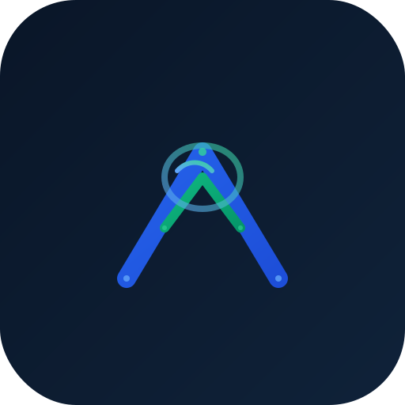

<div align="center">
  
  <h1 align="center" style="font-size: 3em; margin: 10px 0; background: linear-gradient(135deg, #2563EB, #10B981); -webkit-background-clip: text; -webkit-text-fill-color: transparent; background-clip: text;">FinSwitch</h1>
  <p align="center"><strong>AI-Powered Financial Intelligence Platform</strong></p>
  <p align="center">Switch from confusion to confident financial decisions.</p>

  <p align="center">
    <a href="https://github.com/OK45batwal/FINSWITCH">
      
    </a>
    <a href="https://github.com/OK45batwal/FINSWITCH/stargazers">
      
    </a>
    <a href="LICENSE">
      
    </a>
    <br>
    
    
    
    
  </p>
</div>

<br>

---

## ✦ Overview

**FinSwitch** is a modern, AI-powered financial intelligence platform designed for the Indian market. It helps users understand markets, analyze stocks, track portfolios, and make smarter financial decisions — all powered by advanced AI.

> **FinSwitch is NOT a broker.** Users cannot buy or sell stocks directly. Instead, it's a complete financial decision intelligence platform.

---

## ✦ Features

<div style="display: grid; grid-template-columns: repeat(auto-fit, minmax(250px, 1fr)); gap: 16px;">

### 📊 Market Intelligence
Real-time Nifty, Sensex, and stock data with interactive charts, sector heatmaps, and market movers. Live tracking of 10,000+ stocks.

### 🤖 AI Copilot
Natural language chat that explains stocks, compares companies, analyzes markets, and answers financial questions. Like ChatGPT for finance.

### 💼 Portfolio Tracker
Track holdings, view allocation, analyze returns, and get AI-powered insights to optimize your investments.

### 📰 Smart News Feed
Curated financial news with AI summaries, sentiment analysis, and related stock impact assessments. Never miss a market-moving event.

### 📈 Stock Screener
Advanced filters, financial ratios, peer comparison, and fundamental analysis tools for deep research.

### 🎓 Learning Platform
Courses, tutorials, quizzes, and certificates covering finance basics to advanced investing strategies.

### 💰 SIP Planner
Goal-based planning with AI recommendations, future value projections, and inflation-adjusted targets.

### 🔔 Smart Alerts
Price, news, dividend, IPO, and volatility alerts with push notifications.

</div>

---

## ✦ Tech Stack

```
Frontend     →  Flutter (iOS, Android, Web)
Backend      →  Python FastAPI
Database     →  PostgreSQL 15 + Redis Cache
AI           →  LLM-powered Financial Intelligence
Auth         →  JWT + Firebase Authentication
Infra        →  Docker · Celery Workers
```

---

## ✦ Screenshots

<table>
  <tr>
    <td width="50%"></td>
    <td width="50%"></td>
  </tr>
  <tr>
    <td align="center"><em>Landing Page — Hero Section</em></td>
    <td align="center"><em>Features & AI Demo</em></td>
  </tr>
  <tr>
    <td width="50%"></td>
    <td width="50%"></td>
  </tr>
  <tr>
    <td align="center"><em>Live Market Data Table</em></td>
    <td align="center"><em>Portfolio Dashboard Preview</em></td>
  </tr>
</table>

> **Note:** Take screenshots by serving the website locally with `python3 -m http.server 3000` from the `website/` directory, then replace the image filenames above with actual screenshots.

---

## ✦ Project Structure

```
finswitch/
├── branding/              # Logo, brand guidelines, favicon
├── website/               # Premium landing page (HTML/CSS/JS)
│   ├── index.html         # Main landing page
│   ├── css/               # Design system + page styles
│   ├── js/                # Animations, interactions
│   └── assets/            # Logo, favicon
├── backend/               # FastAPI backend
│   ├── app/
│   │   ├── api/v1/        # REST API routes (auth, markets, portfolio, AI...)
│   │   ├── core/           # Config, security, database
│   │   ├── models/         # SQLAlchemy ORM models
│   │   ├── schemas/        # Pydantic request/response schemas
│   │   ├── services/       # Business logic
│   │   └── workers/        # Celery background tasks
│   ├── database/           # PostgreSQL schema
│   ├── Dockerfile
│   └── docker-compose.yml
├── flutter_app/            # Mobile app (iOS + Android)
│   └── lib/
│       ├── app/            # App shell, theme, navigation
│       ├── core/           # Networking, storage, constants
│       └── features/       # Feature modules
├── admin/                  # Admin dashboard
├── API.md                  # API documentation
├── ARCHITECTURE.md         # Architecture overview
├── DEPLOYMENT.md           # Deployment strategy
├── PERSONAS.md             # User personas
└── ROADMAP.md              # Development roadmap
```

---

## ✦ Quick Start

### Backend
```bash
cd backend
cp .env.example .env
docker-compose up
# API available at http://localhost:8000
# Docs at http://localhost:8000/api/docs
```

### Flutter App
```bash
cd flutter_app
flutter pub get
flutter run
```

### Website
```bash
cd website
python3 -m http.server 3000
# Open http://localhost:3000
```

---

## ✦ API Endpoints

| Method | Endpoint | Description |
|--------|----------|-------------|
| POST | `/api/v1/auth/register` | Create account |
| POST | `/api/v1/auth/login` | Sign in |
| GET | `/api/v1/markets/indices` | Nifty, Sensex, Bank Nifty |
| GET | `/api/v1/markets/stocks` | Stock screener with filters |
| GET | `/api/v1/markets/gainers` | Top gainers |
| GET | `/api/v1/markets/losers` | Top losers |
| GET | `/api/v1/portfolio/summary` | Portfolio overview |
| GET | `/api/v1/portfolio/holdings` | Portfolio holdings |
| POST | `/api/v1/ai/chat` | AI Copilot chat |
| GET | `/api/v1/news` | Financial news feed |
| POST | `/api/v1/sip/calculate` | SIP calculator |

Full documentation: [API.md](API.md)

---

## ✦ Roadmap

- **Phase 1** ✅ Core Platform — Market data, portfolio, AI chat, news
- **Phase 2** 🔄 Advanced Analytics — Stock screener, technical indicators, comparisons
- **Phase 3** 📅 Learning Platform — Courses, quizzes, certificates
- **Phase 4** 📅 Advanced AI — Predictive analytics, sentiment analysis
- **Phase 5** 📅 Ecosystem — International markets, premium tiers

See [ROADMAP.md](ROADMAP.md) for details.

---

## ✦ Design System

| Token | Value |
|-------|-------|
| Primary | `#2563EB` — Deep Royal Blue |
| Accent | `#10B981` — Emerald Green |
| Background | `#0A1628` — Rich Dark Navy |
| Font | Inter (UI) · Outfit (Display) |

Dark-first, premium glassmorphism design inspired by CRED, TradingView, and Apple.

---

## ✦ Security

- 🔒 JWT authentication with refresh tokens
- 🛡️ Password hashing with bcrypt
- 🔐 HTTPS enforced everywhere
- 📋 Audit logging for sensitive actions
- 🚦 Rate limiting on API endpoints
- ✅ OWASP best practices

---

## ✦ License

MIT License — see [LICENSE](LICENSE) for details.

---

<div align="center">
  <p>Built with ❤️ for smarter investing in India</p>
  <p>
    <a href="https://github.com/OK45batwal/FINSWITCH">GitHub</a> ·
    <a href="website/index.html">Live Demo</a> ·
    <a href="API.md">API Docs</a>
  </p>
</div>
